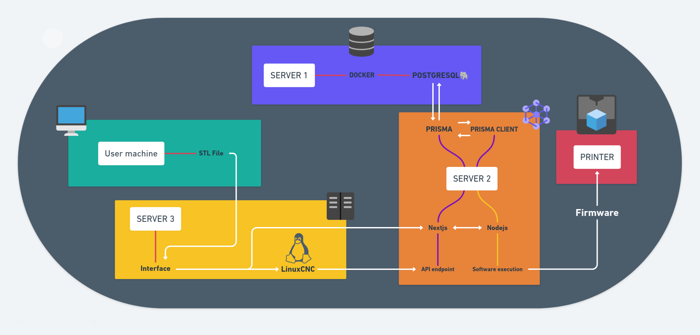

# metalPrint

**metalPrint** is an open-source software suite for controlling stepper motors and a torch (current, voltage, etc.) for a metal 3D printer. It includes CLI tools, sensor data parsing, visualization, and a non-technical user interface.

---

## Project Structure Overview

### `interface/`
Contains user interfaces (CLI and graphical), visualization tools, and configuration management utilities. These components allow users to interact with the printer, monitor print progress, and adjust hardware settings.

#### `interface/config/visualizer`
A specialized module for rendering parsed configuration and live sensor data. It provides interactive or static visualizations of hardware states and print progress, making system status intuitive for users.

### `parser.c`
The parser.c file is responsible for reading and interpreting G-code files, the standard for 3D printing instructions. It translates G-code into commands and data structures that describe motor movements and printing actions.

- **G-code Parsing:** Reads G-code commands and converts them into actionable instructions.
- **Translation Layer:** Maps parsed instructions to hardware operations executed by the Arduino logic.

### `motor.ino` and `motor.h`
`motor.ino` is the Arduino sketch that directly controls the stepper motors and torch hardware. It receives commands from the parsed G-code (via parser.c), and uses functions defined in `motor.h` for hardware abstraction.

- **moveTo(xTarget, yTarget):** Moves X/Y stepper motors to target positions, synchronizing arrival.
- **findPos(xTarget, yTarget, zTarget):** Moves all axes to specified positions, with Z-axis retraction and elevation.
- **Integration:** Receives motor instructions translated from G-code, executes physical movements.

---

## Data Flow

1. **G-code Input:** User provides G-code file with printing instructions.
2. **Parsing:** `parser.c` reads G-code, translates it into motor movement commands.
3. **Execution:** `motor.ino` receives movement instructions, calls functions from `motor.h` to move hardware.
4. **User Interface:** `interface` modules allow the user to monitor and control the process, visualize status, and adjust configurations.

---

## Getting Started

### Prerequisites
- **Arduino IDE** ([Download](https://www.arduino.cc/en/software))
- **Arduino Board** (Uno, Mega, Nano, etc.)
- **USB Cable** for uploading firmware
- **Basic Electronics** (wires, breadboard, sensors, actuators)

### Installation
1. Clone the repository:
   ```sh
   git clone https://github.com/brendonmlopes/metalPrint.git
   ```
2. Open the Arduino project in the IDE.
3. Connect your hardware according to your configuration.
4. Upload the firmware.

---

## Contributing

Contributions, issues, and feature requests are welcome!  
See the [issues page](https://github.com/brendonmlopes/metalPrint/issues).

1. Fork this repository
2. Create your feature branch (`git checkout -b feature/AmazingFeature`)
3. Commit your changes (`git commit -m 'Add some AmazingFeature'`)
4. Push to the branch (`git push origin feature/AmazingFeature`)
5. Create a pull request

---

## License

Distributed under the MIT License. See `LICENSE` for details.

---

## Contact

- **Author:** [brendonmlopes](https://github.com/brendonmlopes)
- **Project URL:** [https://github.com/brendonmlopes/metalPrint](https://github.com/brendonmlopes/metalPrint)
